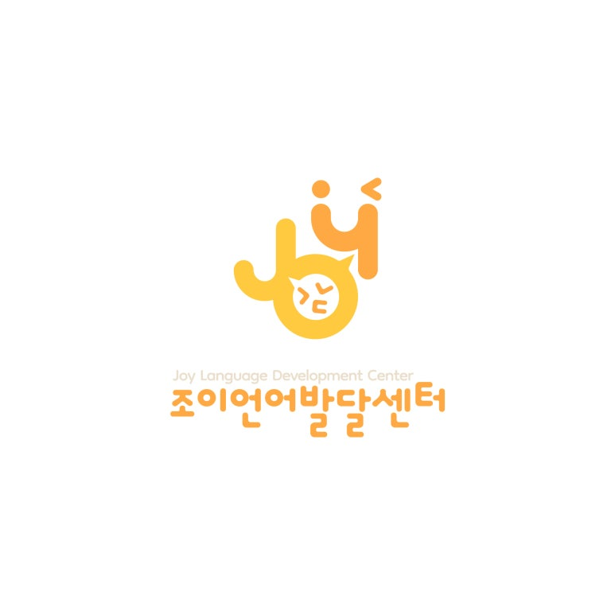

import NaverMap from '@site/src/components/NaverMap';

<!-- truncate -->
  

안녕하세요! 😊  
원주 기업도시에 위치한 <mark>언어치료 전문기관</mark>  
**조이 언어발달센터**입니다.

영유아 부모님들이 가장 많이 궁금해하시는 부분 중 하나가
- <mark>**“말이 늦는 것 같아요.”**</mark>
- <mark>**”집에서 뭘 해주면 좋을까요?”**</mark>

입니다.

특히 **첫 단어가 시작되는 12개월 이후**,  
아이는“엄마, 아빠, 맘마, 멍멍(멈머)”처럼  
**단어 하나로 한 문장을 대신해 표현**하는 시기이지요.

이 시기에는 아이가 일상에서 경험한 것을  
<mark>**언어로 연결해주는 환경**이 무엇보다 중요합니다.</mark>

그래서 오늘은 !  
어디서든 바로 실천할 수 있는  
<mark>**‘한단어 시기 언어촉진법' 3가지**</mark>를  
알려드립니다 :)

>  하넨 센터의 '말이 늦은 아이를 위한 부모 가이드' It Takes Two to Talk을 참고하여 제작하였습니다.

> 글 마지막에는 실제 아이의 놀이 영상도 있으니,  
> 참고하여 보시고 아이와 즐거운 언어놀이시간 되세요!

## 엄마! 아빠! 이렇게 말하지 마세요!
아이는 즐거운 상호작용을 바탕으로 언어를 사용하고, 습득하게 됩니다. 

상호작용을 위해 아이에게 질문을 하고, 여러가지 물어보는 것은 좋으나, 상호작용이 끊길만큼 과하게 물어보시는 경우가 종종 있어요. 

특히, 아이들을 계속해서 시험하는 말은 아이의 언어발달과 상호작용에 큰 도움이 되지 않습니다. 

사진을 참고하셔서, 나의 말은 어떤 유형인지 살펴보고 바꿔봐요:)

## 실제 아이의 놀이 영상 보기
[📀 놀이상황에서 언어자극 이렇게 할 수 있어요!](https://www.instagram.com/reel/DR1RNahkgem/?igsh=MWZtYmc1NTRsZmNqOQ%3D%3D)

---

아이가 또래보다 말이 느린 것 같아  
고민이 되신다면,  
부담 갖지 말고  
<mark>**즐거운 상호작용 놀이부터**</mark> 시작해보세요.

언어 치료실에서 처럼  
<mark>40분씩 집중해서 하지 않아도 괜찮습니다.</mark>

정말 중요한 것은  
얼마나 **진하게**, 얼마나 **따뜻하게**  
아이와 상호작용했는가 바로 그것입니다.

부모라는 존재는  
어떤 전문가도 대신할 수 없는  
가장 특별하고 강력한 자원입니다. 🌿

전국의 모든 부모님들,  
조이 언어발달센터가 늘 함께 응원합니다.

우리아이 언어치료에 대한 고민이 있으신가요?  
가까운 언어치료실에서 상담하세요.
  

---

아이들의 언어발달에 즐거움을 더하는 공간  
**조이 언어발달센터**입니다.

---

Let's enJOY in JOY ! 🎉✨

---

📞 문의: [033-745-1030](tel:033-745-1030)  
💬 카카오채널: [joylangcenter](https://pf.kakao.com/_sxjPXn)  
⭐️ 인스타그램: [@joylangcenter](https://instagram.com/joylangcenter)  
🏠 홈페이지: [joylangcenter.com](https://joylangcenter.com)

<NaverMap />

