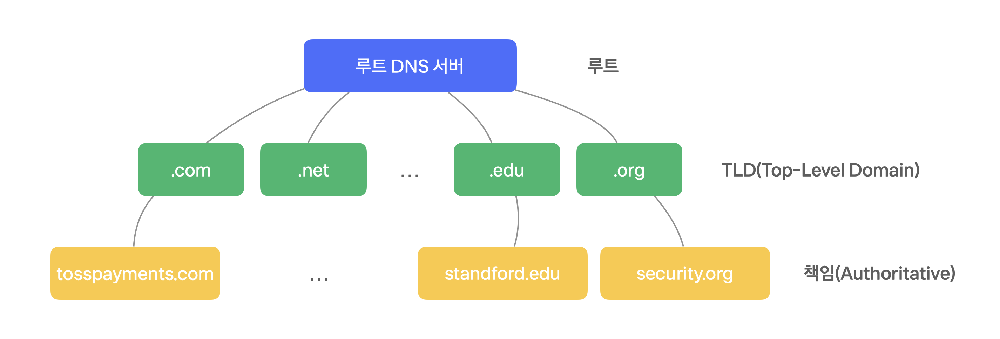

**DNS(Domain Name System)** 는 웹사이트의 도메인 주소를 IP 주소로 변환하는 시스템입니다.

IP 주소는 변환될 수 있으며, 기억하기 어렵기 때문에 대부분의 웹 서비스는 도메인 주소를 사용합니다. **DNS(Domain Name System)** 는 도메인 주소에 대응되는 원격 호스트 IP 주소를 관리하고 질의할 수 있는 시스템 혹은 이를 이용하기 위한 프로토콜을 의미합니다. DNS 시스템 내에서 <mark>**도메인 주소를 관리하는 서버들을 네임 서버라고 부르며, 계층적인 형태로 존재**</mark>합니다.

## ✔️ DNS의 다른 역할
DNS는 도메인 주소를 IP 주소로 변환하는 것으로 가장 잘 알려져 있지만, 다른 중요한 역할도 하고 있습니다.

### 별칭 도메인
DNS는 IP 주소 또는 정식 도메인을 여러 별칭 도메인과 연결시켜 줍니다. 별칭 도메인을 <mark>**CNAME(Canonical Name) 레코드로 등록**</mark>하고 사용하면 되는데요. `example.com`을 주요 도메인으로 사용하고 `web.example.com` 또는 `sales.example.com`을 별칭 도메인으로 등록하면, 모든 도메인 주소로 같은 IP 주소에 접속할 수 있습니다. 웹 뿐만 아니라 메일 주소에도 여러 도메인을 사용할 수 있는 이유입니다.

### 로드 밸런싱
DNS는 클라우드 서비스와 CDN(Content Delivery Network)와 같은 분산 인터넷 서비스를 이용할 때 로드 밸런싱 역할을 합니다. 하나의 도메인으로 들어오는 웹 트래픽을 여러 서버에 분산시켜 속도와 안정성을 확보하는 방법입니다. 사용자의 물리적 거리와 네트워크 상황을 고려해서 최적의 연결을 제공합니다.

## ✔️ DNS 구조
DNS를 이용해 IP 주소를 찾는 과정에는 로컬 네임 서버, 루트 네임 서버, TLD 네임 서버, 권한 네임 서버가 등장합니다.

### 로컬 네임 서버 (Local Name Server)
통신사 DNS, 구글 DNS 처럼 클라이언트와 가장 가까이 존재하는 네임 서버입니다.

### 루트 네임 서버 (Root Name Server)
루트 도메인을 관리하는 서버이며, TLD 네임 서버의 주소를 알고 있습니다.

### TLD 네임 서버 (Top-level Domain Server)
`.com`, `.kr`, `.net`등을 관리하는 네임 서버입니다.

### 권한 네임 서버 (Authoritative Name Server) = 책임 서버
네트워크를 운영하는 기관에서 보유하고 있는 도메인을 관리하는 네임 서버입니다.  
실제로 도메인 이름의 IP 주소를 매핑하여 가지고 있는 서버입니다. DNS 쿼리의 최종 단계에서 실제로 답을 주는 서버입니다.  
ex) `.johnycho.com`을 관리하고, `api.johnycho.com`, `mail.johnycho.com` 의 정보를 관리하는 네임 서버

## ✔️ DNS 질의 과정
DNS는 클라이언트-서버 모델을 이용하는 분산 계층형 데이터베이스 시스템인데요. 스마트폰 또는 컴퓨터와 같은 클라이언트에서 DNS 쿼리가 들어오면 <mark>**DNS 리커서(Recursor)**</mark>가 클라이언트 대신 서버에 쿼리를 보내서 도메인 이름과 연결된 IP 주소를 확인합니다.

DNS 쿼리는 재귀적(Recursive) 또는 반복적(Iterarive) 질의로 해결됩니다. 반복적 질의는 DNS 리커서가 각 계층 서버에 순차적으로 쿼리를 보내서 IP 주소를 찾는 과정인데요. 재귀적 질의는 DNS 리커서가 루트 서버에 쿼리를 한 번만 보내면, 루트 서버가 TLD 서버에 쿼리를 보내고 TLD 서버는 책임 서버에 쿼리를 보냅니다. 책임 서버에 확인되는 최종 IP 주소도 각 계층을 거쳐 루트 서버로 최종적으로 응답되고, 루트 서버가 DNS 리커서에 응답을 전달합니다.

### 예시
* 가장 먼저 클라이언트는 로컬 네임 서버에 `api.johnycho.com`의 IP 주소를 질의합니다.
* 만약, 로컬 네임 서버에서 값을 찾지 못했다면, 로컬 네임 서버는 루트 네임 서버에게 IP 주소를 물어봅니다.
* 요청을 받은 루트 네임 서버는 `.com` TLD 네임 서버 주소를 응답합니다.
* 이를 받은 로컬 네임 서버는 `.com` TLD 네임 서버에 다시 요청을 보내고, `johnycho.com` 권한 네임 서버의 주소를 응답 받습니다.
* 최종적으로 로컬 네임 서버는 권한 네임 서버에서 `api.johnycho.com` IP 주소를 받아서 클라이언트에게 응답합니다.