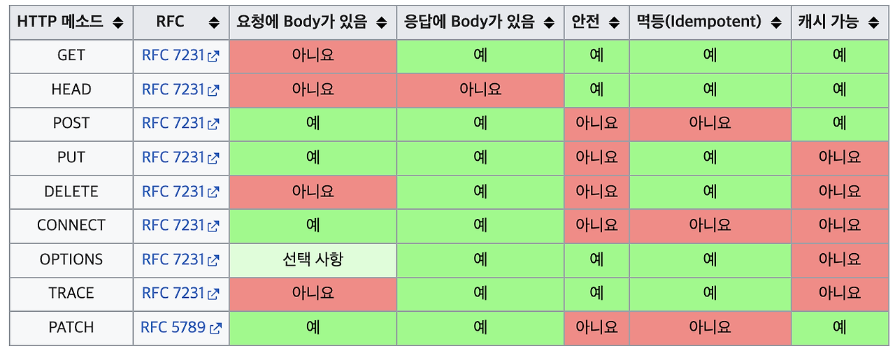
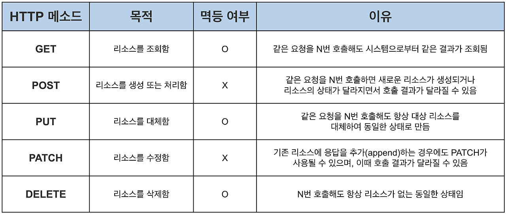

# HTTP 메서드에서 멱등성이란?
연산을 여러 번 적용하더라도 결과가 달라지지 않는 성질을 멱등성이라고 합니다. HTTP 메서드의 멱등성은 동일한 요청을 한번 보내는 것과 여러번 보내는 것이 서로 동일한 효과를 지니며, 서버의 상태도 동일하게 남을 경우에 멱등하다고 이야기할 수 있습니다. 대표적으로 멱등한 메서드는 GET, HEAD, PUT, DELETE, TRACE, OPTIONS 가 있습니다.

## ✔️ 멱등성은 어떻게 활용될 수 있나요? 🤔
모종의 이유로 전송 커넥션이 끊어졌을 때, 멱등성은 클라이언트가 다시 같은 요청을 해도 되는가에 대한 판단 근거가 될 수 있습니다. 멱등하다면 요청을 재시도할 때 같은 서버의 상태를 보장하기 때문에 문제가 없습니다. 반면, 멱등하지 않다면 재시도 요청시 중복 요청을 보내 문제를 발생 시킬 수 있습니다. 예를 들어, 사용자가 결제하는 시점에 타임아웃으로 인해 정상 응답을 못받는 상황을 생각해 볼 수 있습니다. 해당 경우에서 멱등하지 않은 결제 API 경우에는 결제가 성공했는지 수동으로 확인하고 재요청해야합니다. 반면, 멱등한 결제 API의 경우에는 안심하고 여러 번 요청할 수 있으며 중복 요청으로 발생하는 문제(중복 결제)를 방지할 수 있습니다.

## ✔️ DELETE 메소드가 멱등한 이유
예를 들어 자원이 있는 상태에서 우리가 다음과 같이 사용자 삭제 요청을 보냈다고 하자. 처음에는 성공 응답(200)을 받았지만, 동일한 요청을 보냈더니 에러 응답(404)을 받은 것이다.

> 1. DELETE → 200 OK  
> 2. DELETE → 404 NOT FOUND

DELETE를 사용하면 클라이언트가 받는 응답 상태 코드가 달라질 수 있음에도 불구하고 DELETE 메소드는 멱등하다. 왜냐하면 <mark>멱등성의 기준이 “상태 코드”가 아니기 때문</mark>이다. 앞서 살펴본대로 공식 문서의 설명에 따르면 멱등성은 “서버에 미치는 의도된 영향이 동일한가?” 이다. DELETE의 목적은 리소스를 삭제하여 서버에 리소스가 없도록 만드는 것이고, DELETE를 여러 번 호출해도 응답 상태와 무관하게 리소스가 없는 상태를 유지하도록 한다. 그러므로 HTTP DELETE 메소드는 멱등한 것이다.
결국 멱등성은 리소스 관점에서 생각하는 것이 중요하다. 여러 번 요청해도 리소스가 동일하다면 멱등한 것으로 봐도 된다.

