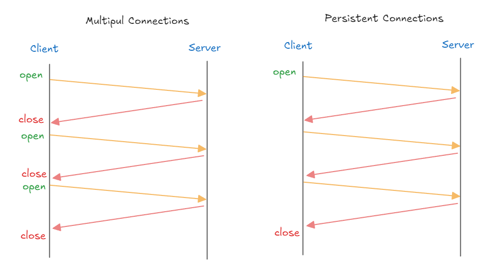
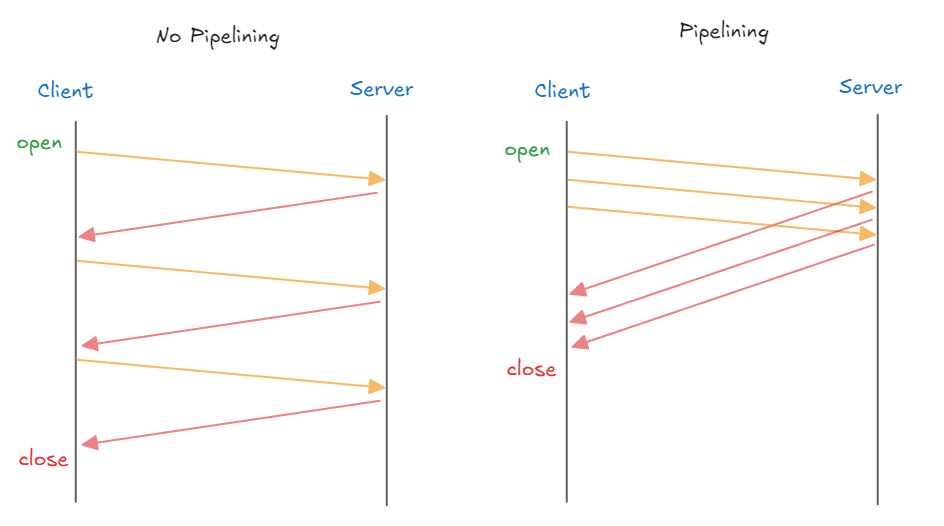
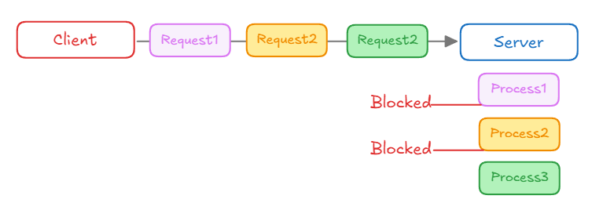
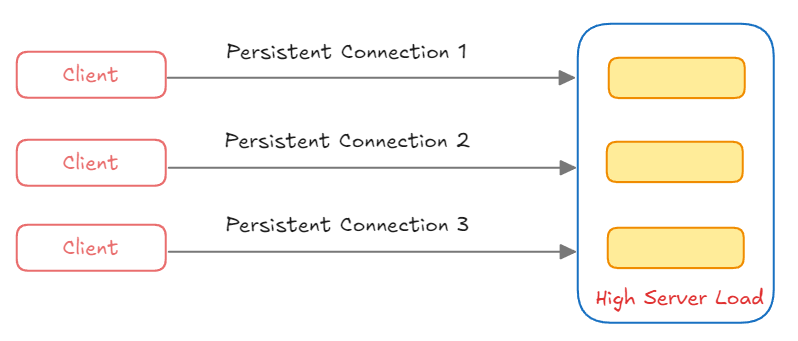
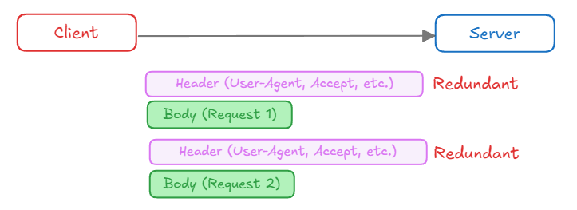
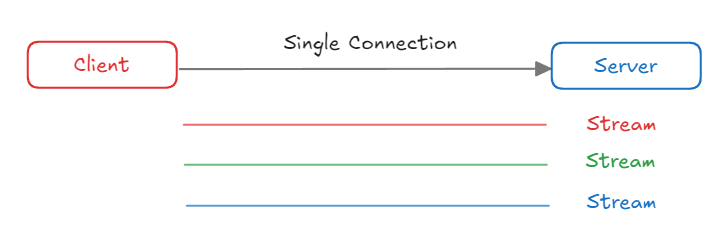
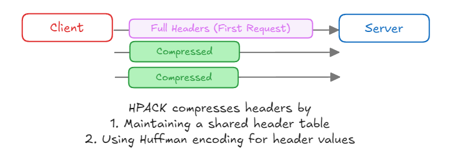
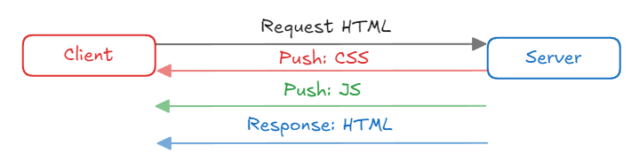

## ✔️ HTTP/1.1
HTTP는 웹상에서 클라이언트와 서버 간 통신을 위한 프로토콜입니다.

`HTTP/1.0`의 경우에는 각 요청마다 새로운 TCP 연결을 맺고, 요청을 처리하고 연결을 끊는 방식이다보니, `3-way handshake`와 `4-way handshake`하는 과정에서 오버헤드가 발생해서 비효율적입니다.
그리고, 각 요청에 대한 응답을 받은 후에 다음 요청을 보낼 수 있기 때문에 요청/응답이 순차적/직렬적으로 처리되어 Latency 가 발생합니다.
`HTTP/1.1`은 이러한 문제를 **Persistent Connection (지속 커넥션)** 이라는 지정한 타임아웃만큼 커넥션을 종료하지 않는 방식으로 해결합니다.

### Persistent Connection (지속 커넥션)

- Client ↔ Server 간 연결을 한 번 맺으면 여러 요청을 그 연결에서 처리 할 수 있게 합니다.
- `Connection: keep-alive` 헤더가 설정되어, Client 나 Server 가 명시적으로 연결을 끊지 않는 한 연결이 유지됩니다.

또한 **Pipelining (파이프라이닝)** 을 지원하여 요청의 응답 지연을 감소합니다. 파이프라이닝에서 HTTP 요청은 연속적이며, 순차적으로 전달됩니다. 기존에는 요청한 이후에 응답을 기다리고 그 다음 요청을 보냈는데요. 파이프라이닝에서는 필요한 모든 자원에 대한 요청을 순차적으로 서버로 전송한 다음 모든 요청에 대한 응답을 한 번에 기다리게 됩니다.

### Pipelining (파이프라이닝)

- Pipelining 은 Client 가 Server 에 여러 요청을 연속적 으로 보내고 순서대로 처리하는 방식입니다.  
단, 응답 순서가 맞지 않을 경우 지연이 발생할 수 있습니다.
- Pipelining 이 적용되면 하나의 Connection 으로 다수의 요청과 응답을 처리할 수 있게 해서 Latency 를 줄일 수 있습니다.

😩 하지만, 완전한 멀티플렉싱이 아닌 응답 처리를 미루는 방식이여서 각 응답의 처리는 순차적으로 처리되며, 결국 후순위 응답은 지연될 수 밖에 없습니다.

## ✔️ HTTP/1.1 의 문제점
`HTTP/1.1` 은 `Persistent Connection`과 `Pipelining`같은 기능을 통해서 `HTTP/1.0`의 단점을 개선했지만, 여전히 여러 문제점이 남아 있습니다.

### 1) Head-of-Line Blocking (HOLB)

- Client가 세 개의 요청 (Request1, Request2, Request3) 을 동시에 보내지만, Server는 순차적으로 처리합니다.
- 첫 번째 요청 (Process1) 이 처리되는 동안 다른 요청들 (Process2, Process3) 은 차단(Blocked) 되어 대기합니다.

### 2) Connection 관리의 비효율성

- 여러 Client가 각각 Server와 `Persistent Connection`을 유지하게 되는 경우 서버는 여러 연결을 동시에 관리해야해서 서버에 부하가 갈 수 있습니다.

### 3) Header Overhead

- Client가 Server에 여러 요청을 보낼 때, 각 요청마다 동일한 Header 를 반복해서 전송하게 됩니다.
- 중복된 Header 정보는 불필요한 대역폭을 차지하게 되어서 효율성이 떨어지게 됩니다.

## ✔️ HTTP/2.0
`HTTT/1.1`는 메시지를 일반 텍스트 형식으로 전송했습니다. 2.0부터는 기존 HTTP 메시지를 프레임이라는 단위로 분할하고 이를 바이너리 형태로 만들어서 전송합니다. 따라서, 기존 1.1 버전에 비해 <mark>**파싱 및 전송 속도가 향상**</mark>되었습니다.

또한, `HTTP/2.0` 부터는 **멀티플렉싱(Multiplexing)** 을 지원합니다. 이는 <mark>**하나의 커넥션을 사용하여 요청과 응답을 병렬로 처리할 수 있는 방식**</mark>입니다. 클라이언트가 서버로 여러 요청을 동시에 보내도 각 요청이 독립적으로 처리되기 때문에 애플리케이션 레이어의 HOL Blocking 문제를 해결합니다.
또한 **HPACK 헤더 압축 방식**을 사용해 반복되는 헤더를 효율적으로 관리하여 대역폭 사용이 최적화되었습니다.

### 1) Multiplexing

- `HTTP/2.0`는 요청과 응답을 병렬로 처리 할 수 있는 멀티 플렉싱입니다.
- 여러 TCP 연결을 설정할 필요가 없어서 네트워크 오버헤드가 감소됩니다.
- Client 가 여러 요청을 동시에 보내도, 각 요청이 독립적으로 처리되어서 `Head-of-Line Blocking`문제를 해결합니다.
- 각 스트림에 우선 순위 를 할당하여 중요한 리소스 먼저 전송할 수 있습니다.

### 2) Header 압축 (HPACK)

- `HPACK`이라는 헤더 압축 방식을 통해 반복적으로 전송되는 헤더 정보를 효율적으로 관리하며, 데이터 전송량을 줄이고, 대역폭 사용을 최적화합니다.

### 3) 서버 푸시 (Server Push)

- Client 가 요청하지 않은 리소스도 Server 가 미리 전송할 수 있게 하여 페이지 로딩 속도를 개선합니다.
- 여러 요청/응답 사이클을 줄여 네트워크 사용을 최적화합니다.
- 우선 순위를 지정해 중요한 리소스를 먼저 푸시하여 페이지 렌더링 속도를 향상 시킬 수 있습니다.