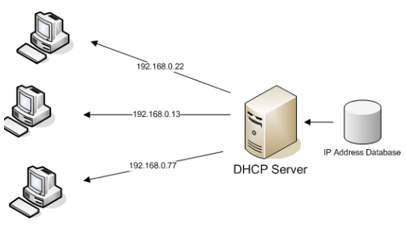
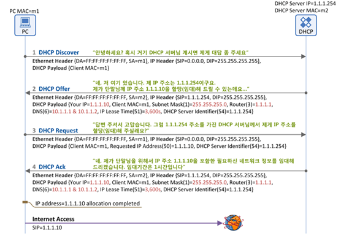

네트워크에서 호스트에게 IP를 할당하는 방식은 크게 <mark>**정적 할당 방식**</mark>과 <mark>**동적 할당 방식**</mark>이 존재합니다.

## ✔️ 정적 할당 방식
호스트에게 IP를 할당할 때 수동으로 설정하는 것을 의미합니다. 일반적으로 정적으로 IP를 할당하기 위해서는 부여하고자 하는 IP 주소, 자신의 네트워크의 서브넷마스크, 자신의 게이트웨이, DNS 주소가 필요합니다. 만약, IP 주소를 정적으로만 할당한다면 호스트의 수가 많아질수록 IP 할당이 번거로워질 수 있으며, 중복 IP를 입력하는 등 실수를 유발할 수 있습니다. 이러한 경우에 동적 할당 방식을 사용할 수 있습니다.

## ✔️ 동적 할당 방식
호스트 IP를 자동으로 할당하는 방식이라는 점에서 정적 할당 방식과 차이가 있습니다. 동적 할당 방식은 주로 <mark>**DHCP(Dynamic Host Configuration Protocol)**</mark>을 사용합니다. 동적 할당 방식은 `DHCP`를 이용해 현재 사용하지 않는 IP를 호스트에게 임대해줍니다. 따라서, 동적 할당 방식을 사용하는 경우에는 IP 주소가 고정적이지 않으며, 바뀔 가능성이 존재합니다. 또한, `IPv4`에 대한 `DHCP`는 `DHCPv4`, `IPv6`에 대한 `DHCP`는 `DHCPv6`가 존재합니다.

## ✔️ DHCP를 이용한 IP 주소 동적 할당 과정
`DHCP`를 이용한 동적 할당 방식은 호스트와 `DHCP`서버(일반적으로 라우터)간에 통신으로 이루어집니다. 크게 4가지 단계로 나누어 IP 주소를 할당합니다. (`Discover`, `Offer`, `Request`, `Acknowledgment`)

### 1) Discover 단계
호스트는 Discover 메시지를 브로드캐스팅하여 DHCP 서버를 찾습니다.
### 2) Offer 단계
DHCP 서버는 Offer 메시지를 호스트에게 전송합니다. Offer 메시지에는 호스트에게 할당해 줄 IP 주소와 임대 기간이 포함되어 있습니다.
### 3) Request 단계
호스트는 DHCP Offer 메시지에 대한 응답을 수행합니다. 호스트는 Request Message를 브로드캐스팅합니다.
### 4) Acknowledgment 단계
DHCP 서버는 ACK 메시지를 호스트에게 전송하여 IP 임대를 승인합니다.

위 과정이 모두 끝난 이후 클라이언트는 할당받은 IP 주소를 자신의 IP 주소로 설정하고 임대 기간 동안 사용할 수 있습니다. 임대 기한이 만료된 경우 `DHCP`과정을 다시 반복해야 하지만, <mark>**DHCP 임대 갱신(DHCP Lease Renewal)**</mark>을 통해서 임대 기간을 연장할 수 있습니다.