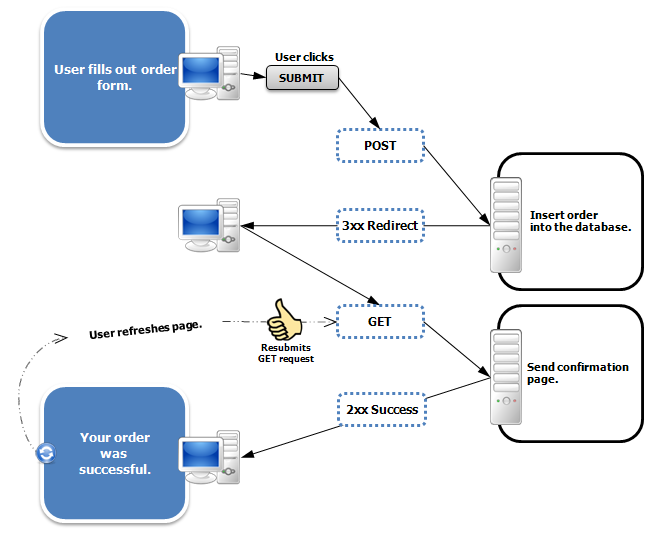

## ✔️ PRG 패턴
`Post/Redirect/Get` 패턴의 약자로, 웹 애플리케이션에서 폼 제출 후 페이지 새로 고침이나 브라우저 뒤로 가기 등의 문제를 방지하기 위해 사용하는 디자인 패턴입니다.
<mark>**일반적으로 멱등성이 보장되지 않는 `POST` 요청에 사용**</mark>합니다.

예를 들어, 사용자가 웹 페이지에서 주문 버튼을 클릭하고 새로고침을 수행하면 2번의 `POST` 요청이 서버로 전달되는데요. 이러한 상황에서 `PRG 패턴`이 주로 사용됩니다.

## ✔️ PRG 패턴 처리 과정
* 사용자가 폼을 제출하면 클라이언트는 서버에 `POST` 요청을 보냅니다. 서버는 이 요청을 처리하여 데이터베이스를 업데이트하거나 다른 작업을 수행합니다. (`Post`)
* 서버는 `POST` 요청을 처리한 후, 클라이언트에게 새로운 URL로 리디렉션하라는 응답을 보냅니다. 이 리디렉션은 클라이언트에게 302 Found 상태 코드와 함께 새로운 URL을 포함한 Location 헤더를 반환하여 수행됩니다. (`Redirect`)
* 클라이언트는 서버의 응답을 받아 새로운 URL로 `GET` 요청을 보냅니다. 서버는 이 `GET` 요청을 처리하여 최종 결과 페이지를 클라이언트에게 반환합니다. (`Get`)

## ✔️ PRG 패턴을 사용하지 않을 경우 문제점
### 1. 새로고침으로 인해 동일한 요청을 연속적으로 보내지는 이슈 발생
웹 브라우저의 새로 고침은 마지막에 서버에 전송한 데이터를 다시 전송하게 됩니다.

그래서 만약 결제 같은 중요한 로직을 `POST` 방식으로 구현을 했다면, 마지막으로 서버에 전송한 데이터가 `POST` 요청에 대한 응답 결과물이기 때문에 새로고침을 한다면 계속 중복 결제가 되는 심각한 문제점이 발생하게 됩니다.

### 2. POST 요청은 URL을 공유하더라도 다른 사람과 공유 할 수 없다.
Form 형식의 `POST` 요청을 보낼 경우 파라미터값들이 URL에 포함되지 않기 때문에,
특정 파라미터가 필요한 `POST` 요청인 경우 URL을 복사, 붙여넣기 하더라도 서버에서는 에러 페이지만을 내보내게 됩니다.