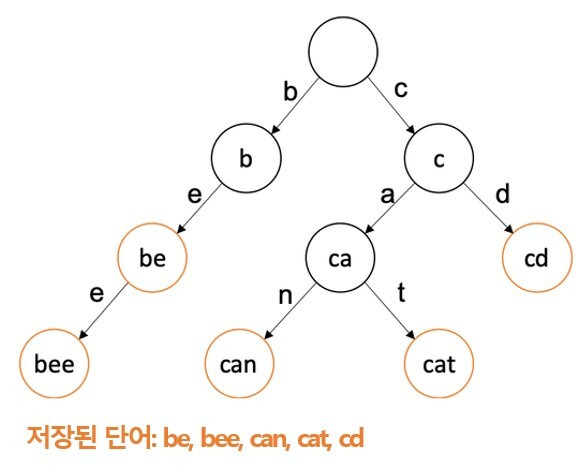

## ✔️ `트라이 (Trie)` 자료 구조란?
<mark>**문자열 집합을 효율적으로 저장하고 탐색하기 위해 특화된 트리 자료 구조**</mark>로, `Digital Tree`, `Radix Tree`, `Prefix Tree` 라고도 부릅니다.  
`트라이(Trie)`라는 명칭은 <mark>re**trie**val tree</mark>에서 나온 단어입니다.  
문자열 자동 완성 기능과 같이 문자열을 저장하고 탐색하는데 유용하게 사용됩니다.

### 구조

* 루트 노드는 특정 문자를 의미하지 않고 자식 노드만 가지고 있습니다. (= 루트 노드는 빈 문자와 연관)
* 이 때, 자식 노드를 `Map<Key, Value>` 형태로 가지고 있습니다.
* 루트 노드를 제외한 노드의 자손들은 해당 노드와 공통 접두어를 가지고 있습니다.
* 정렬된 트리구조 입니다.

### 장점
문자열을 하나씩 전부 비교하는 것보다, 시간 복잡도 측면에서 검색이 더욱 효율적이고 빠릅니다

### 단점
각 노드에서 자식들에 대한 포인터들을 배열로 모두 저장하기 때문에, <mark>**저장 공간의 크기가 큽니다.**</mark>

## ✔️ `트라이 (Trie)` 시간 복잡도
제일 긴 문자열의 길이를 `L`이라 하고, 총 문자열의 개수를 `M`이라 할 때 시간 복잡도는 아래와 같습니다.

### 삽입
가장 긴 문자열 길이인 `L`만큼 걸리므로 `O(L)`

### 생성
모든 문자열 `M`개를 넣어야 하고, `M`개에 대해서 트라이에 넣는건 가장 긴 문자열 길이인 `L`만큼 걸리므로 `O(MxL)`

### 탐색
트리를 제일 깊게 탐색하는 경우는 가장 긴 문자열 길이인 `L`까지 깊게 들어가는 것이므로 `O(L)`

## ✔️ `트라이 (Trie)` 구현 방법
트라이 자료구조에서 루트는 항상 비어있으며, 각 간선은 추가될 문자를 키로 가지고 있습니다. 또한, 각 정점은 이전 정점의 값과 간선의 키를 더한 결과를 값으로 가집니다. 트라이를 구현할 때는 이러한 구조를 염두에 두면서 해시 테이블과 연결 리스트를 이용하여 구현할 수 있습니다.
```java
class TrieTest {

    @Test
    void trieTest() {
        Trie trie = new Trie();
        trie.insert("maeilmail");
        assertThat(trie.has("ma")).isTrue();
        assertThat(trie.has("maeil")).isTrue();
        assertThat(trie.has("maeilmail")).isTrue();
        assertThat(trie.has("mail")).isFalse();
    }

    class Trie {

        private final Node root = new Node("");

        public void insert(String str) {
            Node current = root;
            for (String ch : str.split("")) {
                if (!current.children.containsKey(ch)) {
                    current.children.put(ch, new Node(current.value + ch));
                }
                current = current.children.get(ch);
            }
        }

        public boolean has(String str) {
            Node current = root;
            for (String ch : str.split("")) {
                if (!current.children.containsKey(ch)) {
                    return false;
                }
                current = current.children.get(ch);
            }
            return true;
        }
    }

    class Node {

        public String value;
        public Map<String, Node> children;

        public Node(String value) {
            this.value = value;
            this.children = new HashMap<>();
        }
    }
}
```