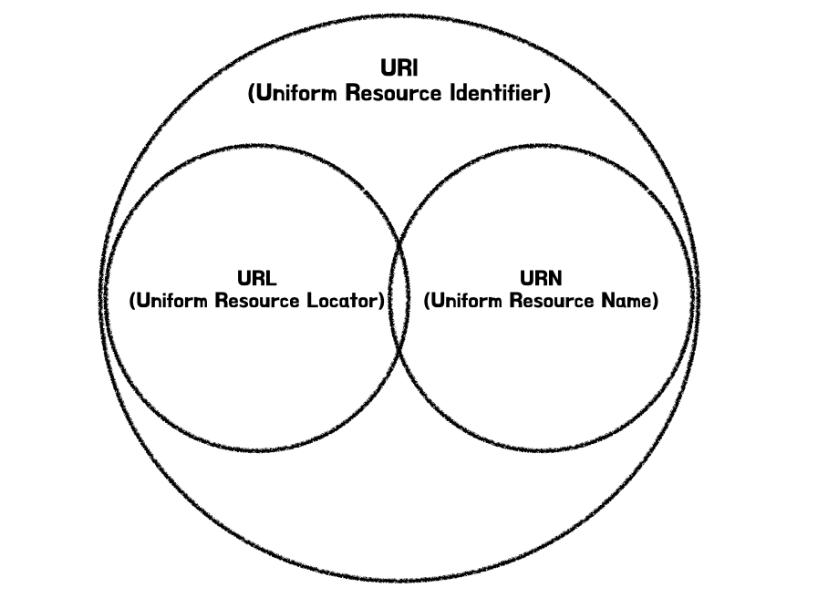

### 1) URI (Uniform Resource Identifier)
인터넷에서 자원을 식별하기 위한 문자열입니다. URI는 <mark>**URL과 URN을 포함하는 상위 개념**</mark>입니다. 즉, 특정 자원을 식별하기 위한 포괄적인 방법을 제공하며, 자원의 위치나 이름을 나타낼 수 있습니다.

### 2) URL (Uniform Resource Locator)
URI의 한 형태로, 인터넷상에서 <mark>**자원의 위치를 나타내는 방식**</mark>입니다. 자원이 어디에 있는지를 설명하는데 사용되며, 자원에 접근하기 위한 프로토콜을 포함합니다. 예를 들어, 웹페이지의 URL은 해당 페이지가 위치한 서버의 주소와 접근 방법(예: HTTP)을 포함합니다.

`https://www.example.com/path/to/resource`

### 3) URN (Uniform Resource Name)
URI의 또 다른 형태로, 자원의 위치와 상관없이 자원의 이름을 식별하는 방식입니다. 자원의 위치가 변하더라도 동일한 식별자를 유지할 수 있게 합니다. 특정 스키마를 따르며, <mark>**자원에 대한 영구적인 식별자를 제공**</mark>합니다.

`urn:isbn:0451450523 (특정 책의 ISBN 번호)`