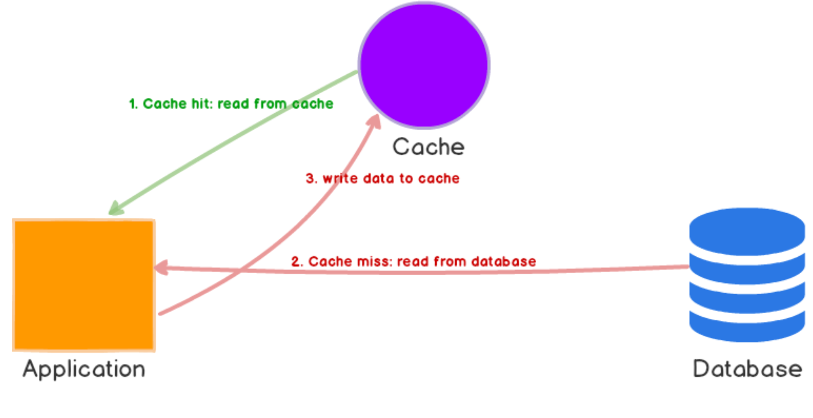
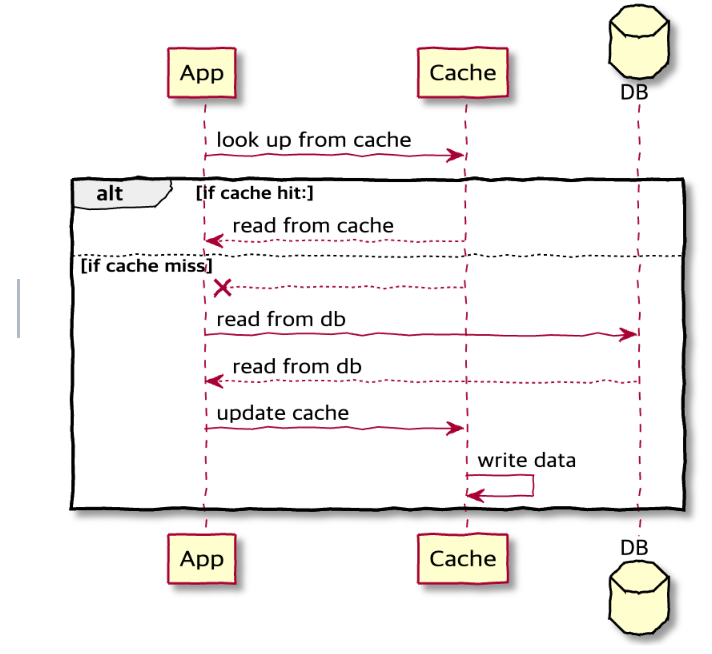
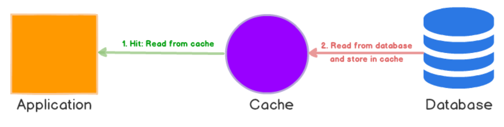
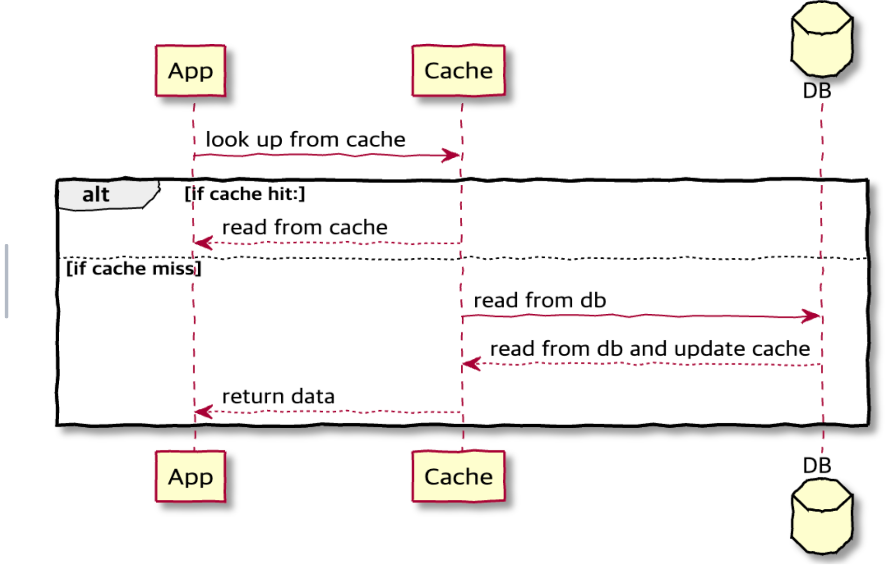
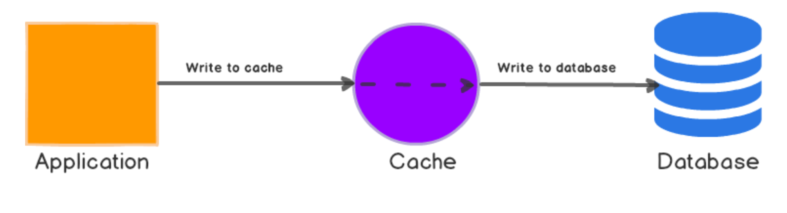
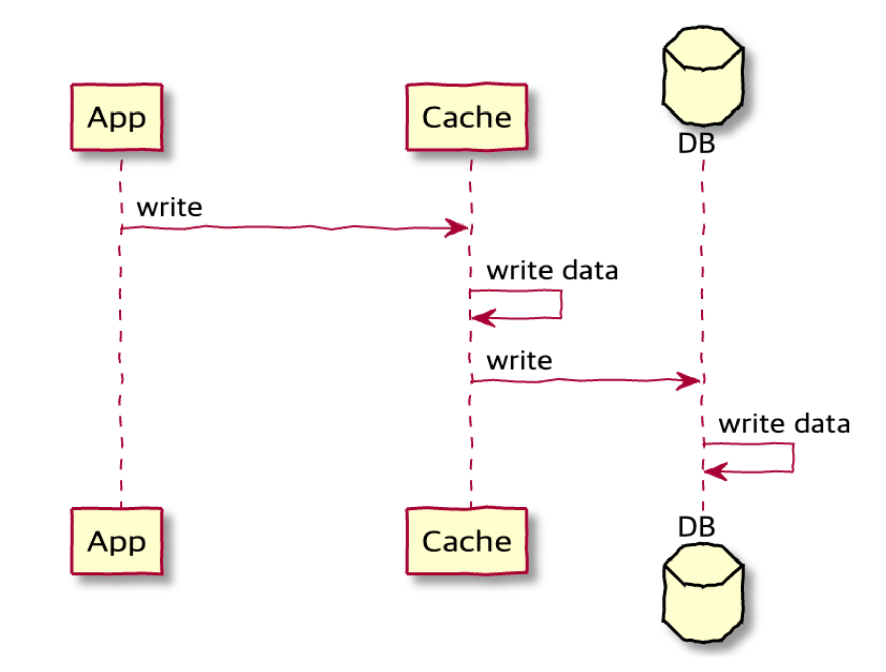
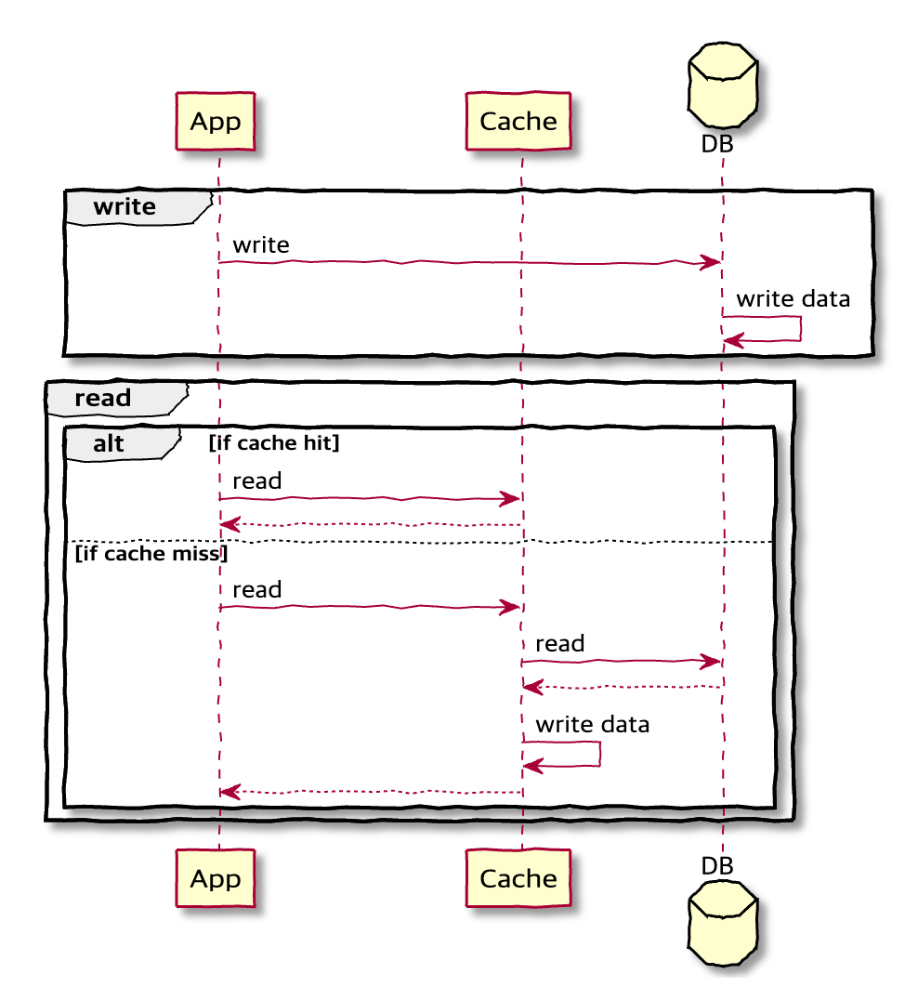
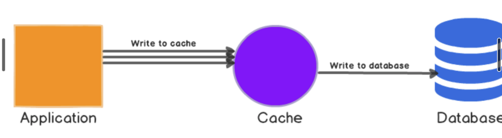
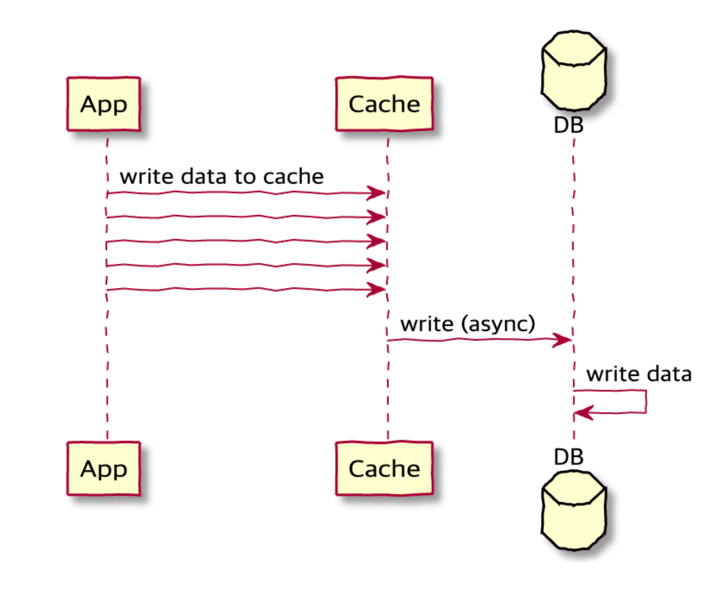

캐시는 성능 향상과 부하 감소를 목표로 합니다. 이때 캐시를 사용하는 양상이 서비스에 큰 영향을 끼치기도 합니다. 따라서, 캐싱 전략을 이해하는 것은 중요합니다.

## ✔️ Cache Aside (Look Aside, Lazy Loading)
`Cache Aside` 방식은 캐시 히트 시 캐시에서 데이터를 불러오며, 캐시 미스 발생 시 원본 데이터베이스에서 조회하여 반환합니다. 애플리케이션은 캐시 미스가 발생하면 해당 데이터를 캐시에 적재합니다.
<mark>**보통 가장 많이 사용되는 캐싱 전략**</mark>입니다. Cache는 Database에 직접 연결되지 않고, application이 주체가 된다.




해당 방식은 실제 요청된 데이터만 캐시에 저장되므로 불필요한 데이터 캐싱을 줄일 수 있습니다. 또한, 캐시에 문제가 발생해도 애플리케이션은 원본 데이터베이스에 직접 접근할 수 있기 때문에 서비스가 계속 작동할 수 있다는 장점이 있습니다. 하지만, 캐시 미스가 발생하는 경우에만 데이터를 캐시에 적재하기 때문에 원본 데이터베이스와 같은 데이터가 아닐 수도 있으며, 초기에는 대량의 캐시 미스로 인한 데이터베이스 부하가 발생할 수 있습니다.

## ✔️ Read Through
- application, cache, database를 inline으로 배치
- 캐시에 데이터가 누락된 경우 데이터 베이스에서 누락된 데이터를 조회하여 캐시에 채우고 application에 반환
- Cache Aside, read-through 모두 데이터를 lazing load한다. 즉, 데이터를 읽을때만 조회한다.
- Application은 Cache Aside와 달리 Cache만 바라본다.
- Cache가 주체(main data store)이다.
- 데이터 동기화 역할은 Cache에게 위임한다.




## ✔️ Write Through
원본 데이터에 대한 변경분이 생긴 경우, 매번 캐시에 해당 데이터를 찾아 함께 변경하는 방식입니다. 2번 쓰기가 발생하지만, 캐시는 항상 최신 데이터를 가지고 있습니다. 캐시는 다시 조회되는 경우에 빛을 발휘합니다. 무작정 데이터를 갱신하거나 저장하는 방식은 리소스 낭비가 될 수 있으니 해당 방식을 사용하는 경우, 만료 시간을 사용하는 것이 권장됩니다.




## ✔️ Cache Invalidation
원본 데이터에 대한 변경분이 생긴 경우, 캐시 데이터를 만료시키는 방식입니다. `Write Through` 방식의 단점을 보완한 방식이며 캐시에 데이터가 삭제되니 캐시 불일치에 대한 걱정을 하지 않아도 됩니다.

## ✔️ Write Around
원본 데이터에 대한 변경분이 생긴 경우, 캐시를 거치지 않고 데이터베이스에만 기록하고, 읽는 데이터만 캐시에 저장하는 전략입니다. 기록하는 데이터가 자주 사용되지 않는 경우에 적합합니다.



## ✔️ Write Behind(Write Back)
원본 데이터에 대한 변경분이 생긴 경우, 캐시를 먼저 업데이트한 이후 추후에 원본 데이터를 변경합니다. 디스크 쓰기 작업을 비동기 작업으로 수행하여 성능을 개선할 수 있습니다. 원본 데이터와 캐시가 일시적으로 일치하지 않을 수 있기 때문에 쓰기 작업이 빈번하며 일시적인 캐시 불일치를 허용하는 서비스에서 유용하게 사용될 수 있습니다.




---

# 캐시 시스템 예시
Ehcache, Caffeine 등 Java 기반 캐시 솔루션은 Cache Loader와 같은 기능을 제공하여 캐시 시스템이 직접 DB에서 데이터를 로딩해오는 기능을 제공합니다.

Redis는 자체적으로 직접 DB에 접근하여 자동으로 로딩하는 기능을 내장하지 않으므로 어플리케이션에서 직접 구현필요(결국 Cache Aside 전략)

## ✔️ Caffeine Cache
```java
// 예시 (Caffeine Cache 사용)
import com.github.benmanes.caffeine.cache.Caffeine;
import com.github.benmanes.caffeine.cache.LoadingCache;
import java.util.concurrent.TimeUnit;

public class UserCache {

  private final LoadingCache<Long, User> cache;

  public UserCache(UserRepository userRepository) {
    this.cache = Caffeine.newBuilder()
        .maximumSize(1000)
        .expireAfterWrite(10, TimeUnit.MINUTES)
        .build(userId -> userRepository.findById(userId)); // 캐시 로딩 로직
  }

  public User getUser(Long userId) {
    // 캐시에서 조회. Miss시 자동으로 DB에서 로딩하여 저장
    return cache.get(userId);
  }
}
```

## ✔️ Ehcache
```java
package com.example;

import org.ehcache.spi.loaderwriter.CacheLoader;
import java.util.HashMap;
import java.util.Map;

public class UserCacheLoader implements CacheLoader<Long, User> {

    private final UserRepository userRepository;

    public UserCacheLoader() {
        // 일반적으로 Spring 컨텍스트를 통해 가져옴
        this.userRepository = ApplicationContextProvider.getBean(UserRepository.class);
    }

    @Override
    public User load(Long userId) throws Exception {
        // Ehcache가 이 메서드를 캐시 Miss시 자동 호출
        return userRepository.findById(userId);
    }

    @Override
    public Map<Long, User> loadAll(Iterable<? extends Long> userIds) throws Exception {
        Map<Long, User> users = new HashMap<>();
        for (Long id : userIds) {
            users.put(id, userRepository.findById(id));
        }
        return users;
    }
}
```