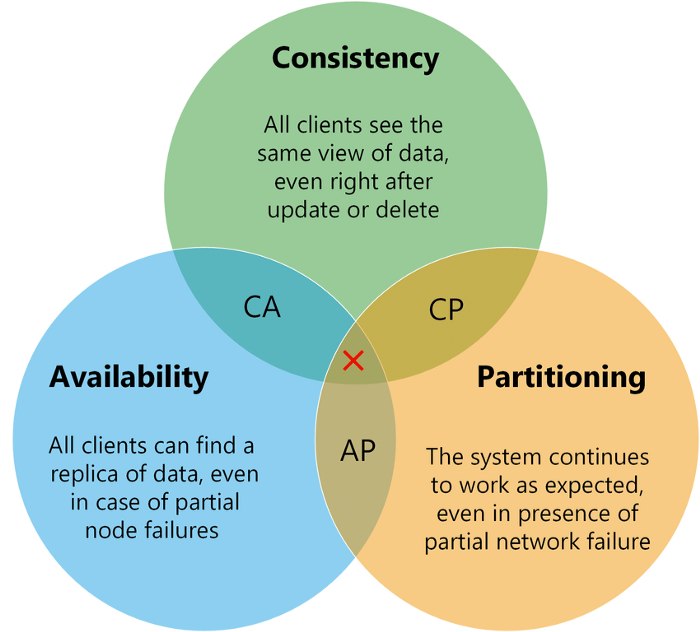

CAP 정리 (= 브루어(Brewer)의 정리)는 분산 데이터베이스 시스템이 CAP 중 2개의 속성만을 제공할 수 있다는 이론입니다. CAP 정리에 따르자면, `일관성(Consistency)`, `가용성(Availability)`, `분할 내성(Partition Tolerance)` 등 <mark>**3가지 속성을 모두 만족하는 분산 데이터베이스 시스템은 존재하지 않습니다.**</mark>

## ✔️ CAP 속성

### 1) 일관성 (Consistency)
모든 클라이언트 요청은 어느 노드에 연결되어도 같은 데이터를 볼 수 있음을 의미합니다.

### 2) 가용성 (Availability)
노드 일부에 문제가 발생하여도 시스템은 클라이언트의 모든 요청에 유효한 응답을 전해줄 수 있어야 함을 의미합니다.

### 3) 분할 내성 (Partition Tolerance)
노드 사이에 통신이 불가능한 상황(파티션)에서도 시스템이 계속 동작한다는 것을 의미합니다.

## ✔️ 속성 조합

### 1) CA (Consistency + Availability)
CA 시스템은 네트워크가 절대 끊기지 않는다는 전제 아래에서만 동작 가능합니다.
그런데 현실 세계의 네트워크는 언제든지 장애(Partition)를 일으킬 수 있고, 분산 시스템은 <mark>**기본적으로 여러 노드(서버) 네트워크를 통해 통신**</mark>하기 때문에, 네트워크 장애가 생길 수 있다는 걸 항상 고려해야 합니다.

#### 🎯 <mark>P는 현실에서 “기본 옵션”</mark>
분산 시스템에서 P(Partition tolerance)를 포기한다는 건, 네트워크 장애가 발생했을 때 시스템 전체를 중단하겠다는 말과 같습니다.
그런데 네트워크 장애는 언제든지 생길 수 있기 때문에 P를 포기한 시스템(CA)은 사실상 사용할 수 없습니다. 따라서 대부분의 실전 시스템은 CP 또는 AP 중 하나를 선택합니다.

단일 서버의 전통적인 RDBMS는 네트워크 분할 자체가 없으니 CA에 해당하지만 분산 시스템은 아닙니다.

### 2) CP (Consistency + Partition tolerance)
파티션이 발생한 상황에서 파티션이 해결되기 전까지 다른 데이터베이스의 연산을 중단시켜 일관성을 지키고 가용성을 희생합니다.
즉, 네트워크 장애 시 가용성을 희생하고 일관성은 유지하므로, 네트워크 분할 시 일부 요청이 실패할 수 있습니다.

### 3) AP (Availability + Partition tolerance)
파티션 문제가 발생해도 읽기 및 쓰기 작업을 중단하지 않습니다. 이 경우 일관성은 희생되지만 파티션 문제가 해결되는 경우 동기화 작업을 수행하여 최종적인 일관성을 보장할 수 있습니다.
즉, 네트워크 장애 시 일관성을 희생하고 응답은 하기 때문에 일관성이 잠시 깨지더라도 시스템은 동작합니다.