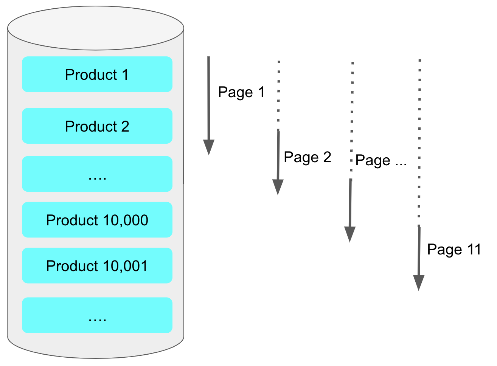
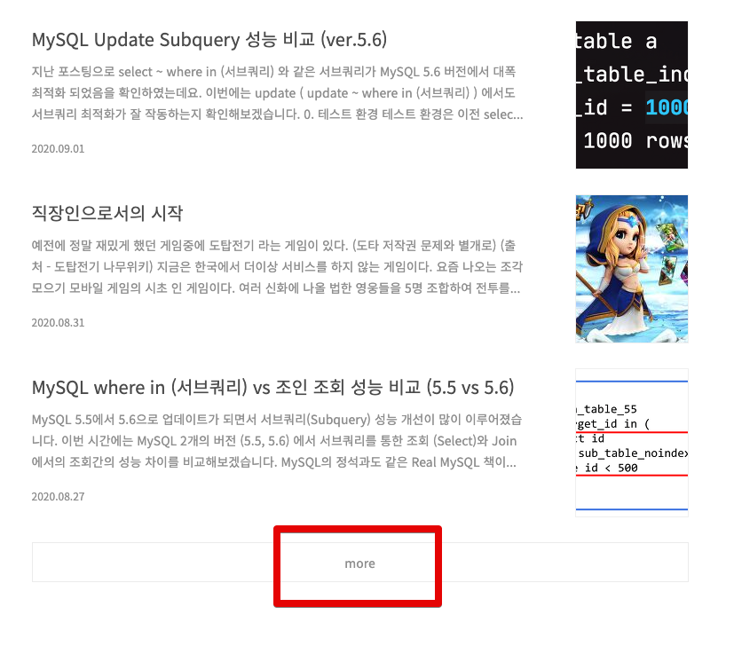

**페이징 쿼리(Paging Query)** 는 전체 데이터를 부분적으로 나누어 데이터를 조회하거나 처리할 때 사용됩니다. 

데이터를 상대적으로 작은 단위로 나누어 처리하기 때문에 데이터베이스나 애플리케이션의 리소스 사용 효율이 증가하며, 로직 처리 시간을 단축 시킬 수 있습니다.

`MySQL`에서 페이징 쿼리는 일반적으로 `LIMIT`, `OFFSET` 구문을 사용하여 작성합니다.

```sql
SELECT *
FROM items
WHERE 조건문
ORDER BY id DESC
OFFSET 페이지번호
LIMIT 페이지사이즈
```

## ✔️ LIMIT, OFFSET 방식 페이징 쿼리의 단점
`LIMIT, OFFSET` 방식의 페이징 쿼리는 뒤에 있는 데이터를 읽을 수록 점점 응답 시간이 길어질 수 있는데,
뒤로 갈수록 느린 이유는 `DBMS`는 지정된 `OFFSET` 수만큼 모든 레코드를 읽은 이후에 데이터를 가져오기 때문입니다.


예를 들어 `offset 10000, limit 20` 이라 하면, 최종적으로 `10,020`개의 행을 읽어야 합니다. (`10,000`부터 `20`개를 읽어야 하기 때문)

그리고 실제 필요한건 마지막 `20`개뿐이기 때문에 앞의 `10,000`개 행을 버리게 됩니다.  
뒤로 갈수록 버리지만 읽어야 할 행의 개수가 많아 점점 뒤로 갈수록 느려지는 것입니다.

## ✔️ No Offset 방식
#### `LIMIT, OFFSET` 방식이 아래와 같이 페이지 번호 (offset) 와 페이지 사이즈 (limit) 를 기반으로 한다면,


#### `No Offset` 방식은 아래와 같이 페이지 번호 (offset)가 없는 더보기 (More) 방식을 이야기 합니다.


`No Offset`은 조회 시작 부분을 인덱스로 빠르게 찾아 매번 첫 페이지만 읽도록 하는 방식입니다.  
(클러스터 인덱스인 PK를 조회 시작 부분 조건문으로 사용했기 때문에 빠르게 조회됩니다.)

```sql
SELECT *
FROM items
WHERE 조건문
AND id < 마지막조회ID # 직전 조회 결과의 마지막 id
ORDER BY id DESC
LIMIT 페이지사이즈
```
이전에 조회된 결과를 한번에 건너뛸수 있게 마지막 조회 결과의 ID를 조건문에 사용하는 것으로, 매번 이전 페이지 전체를 건너 뛸 수 있음을 의미합니다.  
즉, 아무리 페이지가 뒤로 가더라도 처음 페이지를 읽은 것과 동일한 성능을 가지게 됩니다.