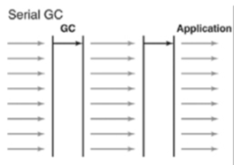
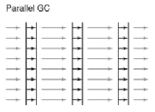
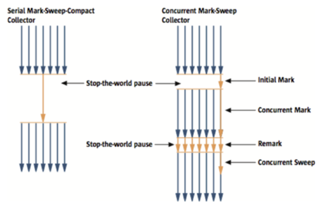
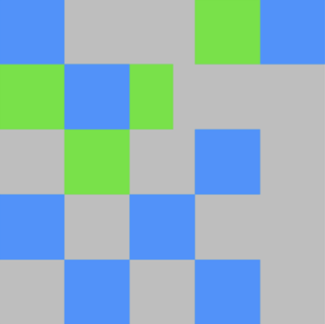

## ✔️ Serial GC (`-XX:+UseSerialGC`)
JDK에 도입된 최초의 가비지 컬렉터이며, <mark>**단일 스레드로 동작**</mark>하는 가장 단순한 형태입니다.

<mark>**힙 메모리와 CPU 코어 개수가 적을 때 적합**</mark>한 방식이며, <mark>**`Stop-The-World` 시간이 가장 길게 발생**</mark>합니다.



## ✔️ Parallel GC (`-XX:+UseParallelGC`)
Java 5부터 8까지 default 가비지 컬렉터로 사용되었으며, `Serial GC`와 달리 <mark>**`Young` 영역의 GC를 멀티 스레드로 수행**</mark>합니다.

높은 처리량에 초점을 두기 때문에 `Throughput GC`라고도 불립니다.

<mark>**메모리가 충분하고 코어의 개수가 많을 때 적합**</mark>한 방식입니다.



## ✔️ Parallel Old GC (`-XX:+UseParallelOldGC`)
`Parallel GC`의 향상된 버전으로, <mark>**`Old` 영역에서도 멀티 스레드를 활용하여 `GC`를 수행**</mark>합니다.

## ✔️ CMS(Concurrent Mark-Sweep) GC (`-XX:+UseConcMarkSweepGC`)
Java 5부터 8까지 사용된 가비지 컬렉터로, 애플리케이션 스레드와 병렬로 실행되어 `Stop-The-World` 시간을 최소화하도록 설계되었습니다. 

하지만 메모리와 CPU 사용량이 많고, <mark>**메모리 압축을 수행하지 않아 메모리 단편화 문제**</mark>가 있습니다. 

Java 9부터 deprecated 되고, Java 14에서 완전히 제거 되었습니다.



### `Initial Mark` 단계
클래스 로더에서 가장 가까운 객체 중 살아 있는 객체만 찾는 것으로 끝내기 때문에 멈추는 시간은 매우 짧습니다.

### `Concurrent Mark` 단계
방금 살아있다고 확인한 객체에서 참조하고 있는 객체들을 따라가면서 확인합니다. 
이 단계의 특징은 다른 스레드가 실행 중인 상태에서 동시에 진행된다는 것입니다.

### `Remark` 단계
`Concurrent Mark` 단계에서 새로 추가되거나 참조가 끊긴 객체를 확인합니다. 

### `Concurrent Sweep` 단계
가비지를 정리하는 작업을 실행합니다. 이 작업도 다른 스레드가 실행되고 있는 상황에서 진행됩니다.

#### 장점
위와 같은 단계로 진행되는 `GC` 방식이기 때문에 `Stop-The-World` 시간이 매우 짧습니다. 모든 애플리케이션의 응답 속도가 매우 중요할 때 `CMS GC`를 사용하며, `Low Latency GC`라고도 부릅니다.

#### 단점
* 다른 `GC` 방식보다 메모리와 CPU를 더 많이 사용합니다.
* `Compaction` 단계가 기본적으로 제공되지 않습니다.

따라서, `CMS GC`를 사용할 때에는 신중히 검토한 후에 사용해야 합니다. 그리고 조각난 메모리가 많아 `Compaction` 작업을 실행하면 다른 `GC` 방식보다 `Stop-The-World` 시간이 더 길기 때문에 `Compaction` 작업이 얼마나 자주, 오랫동안 수행되는지 확인해야 합니다.

## ✔️ G1(Garbage First) GC (`-XX:+UseG1GC`)
Java 9부터 default 가비지 컬렉터이며, 기존의 `GC` 방식과 달리 힙을 여러 개의 `region`으로 나누어 논리적으로 `Young`, `Old` 영역을 구분합니다.

처리량과 `Stop-The-World` 시간 사이의 균형을 유지하며 `32GB`보다 작은 힙 메모리를 사용할 때 가장 효과적입니다.

`GC` 대상이 많은 `region`을 먼저 회수하기 때문에 `garbage first`라는 이름이 붙었습니다.



`G1 GC`는 바둑판의 각 영역에 객체를 할당하고 `GC`를 실행합니다. 해당 영역이 가득 차면 다른 영역에서 객체를 할당하고 `GC`를 실행합니다. 즉, 지금까지 설명한 `Young`의 세 가지 영역에서 데이터가 `Old` 영역으로 이동하는 단계가 사라진 `GC` 방식이라고 이해하면 됩니다.

`G1 GC`는 장기적으로 말도 많고 탈도 많은 `CMS GC`를 대체하기 위해서 만들어 졌습니다.

### G1 GC의 Humongous 객체란?
`Humongous` 객체는 `region` 크기의 `50%` 이상을 차지하는 큰 객체를 의미합니다. 

`Humongous` 객체는 크기에 따라 하나 또는 여러 개의 연속된 `region`을 차지할 수 있고, <mark>**`region` 내 잉여 공간은 다른 객체에 할당되지 않아 메모리 단편화가 발생할 수 있습니다.**</mark>

`G1 GC`의 기본 전략은 작은 객체는 `Young` 영역에 배치하고 이후 `Survivor → Old`로 승격합니다.

하지만 `Humongous` 객체는 너무 커서 `Young`에서 관리하기 어렵기 때문에, `G1 GC`는 이러한 큰 객체를 `Old` 영역 역할을 하는 `region`들에 바로 배치합니다.  
`Young` 영역을 거치지 않고 <mark>**바로 `Old` 영역에 할당되기 때문에, 연속된 빈 `region`을 확보하기 어려우면 `Full GC`가 발생할 가능성이 높아집니다.**</mark>

이 문제를 해결하려면 `-XX:G1HeapRegionSize` 옵션을 사용하여 `region` 크기를 조정하거나, 큰 객체를 작은 객체로 분할하여 처리해 볼 수 있습니다.

## ✔️ ZGC
Java 11부터 도입된 가비지 컬렉터로, `10ms` 이하의 `Stop-The-World` 시간과 대용량 힙을 처리할 수 있도록 설계 되었습니다.

## ✔️ Shenandoah GC
Red Hat에서 개발한 가비지 컬렉터로, Java 12부터 도입 되었습니다. `G1 GC`와 마찬가지로 힙을 여러 개의 `region`으로 나누어 처리하며, `ZGC`처럼 저지연 `Stop-The-World`와 대용량 힙 처리를 목표로 합니다.

## ✔️ Epsilon GC
Java 11부터 도입되었으며 `GC` 기능이 없는 실험용 가비지 컬렉터입니다. 애플리케이션 성능 테스트에서 `GC` 영향을 분리하거나 `GC` 오버헤드 없이 메모리 한계를 테스트할 때 사용되지만, <mark>**프로덕션 환경에는 적합하지 않습니다.**</mark>

## 📌 2vCPU, 1GB 메모리를 가진 Linux 서버에 JDK 17을 설치하면 어떤 가비지 컬렉터가 사용될까?
<mark>**JDK 9부터 `G1 GC`가 default 가비지 컬렉터**</mark>이지만, 서버 스펙에 따라 자동으로 결정됩니다.

`OpenJDK`에서는 CPU 코어 수가 2개 이상이고 메모리가 2GB 이상일 경우 서버를 `Server-Class Machine`으로 인식합니다. `Server-Class Machine`이라면 가비지 컬렉터로 `G1 GC`가 선택되지만, 이 서버는 조건을 충족하지 않기 때문에 `Serial GC`가 선택됩니다.

`G1 GC`를 사용하려면 서버를 스케일업 하거나 `-XX:+UseG1GC` 옵션을 명시적으로 설정해야 합니다.

### 실행 중인 JVM의 GC 확인 방법
```shell
sudo jcmd {jar PID} VM.info
```
또는
```shell
sudo jinfo {jar PID}
```